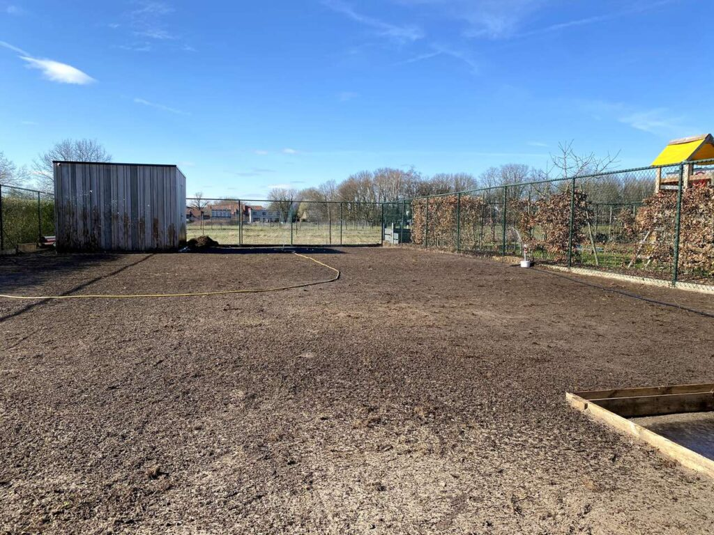

Dit weekend was het na een lange tijd nog eens iets zonniger, hoogtijd om wat buiten te werken. We hebben dan werk gemaakt van onze grasmat.

Voor dit werkje had ik een dag een [tuinfrees (16PK) gehuurd](https://verhuur.obennv.be/nl/producten/tuin/tuinfrees/tuinfrees-barretto-16-pk) om het gras om te frezen. Hierna hebben we dit gelijkt getrokken en dan terug aangewalst. Na het terug rustig losmaken van de grond, kon het gras gezaaid worden.

Als grassoort hebben we gekozen voor [Barenbrug’s zelfherstellend sportgras](https://www.online-tuincentrum.be/Graszaad/Barenbrug-Graszaad/Graszaad-Barenbrug-RPR-Zelfherstellend-Sportgras-met-Yellow-Jacket-Water-Manager/).

