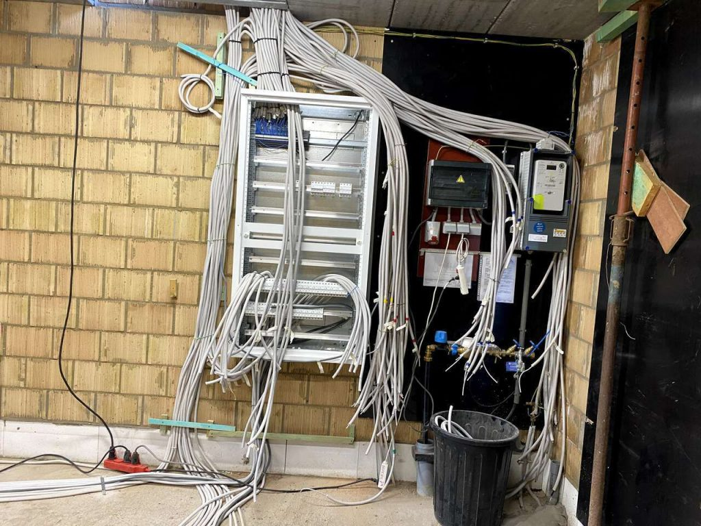
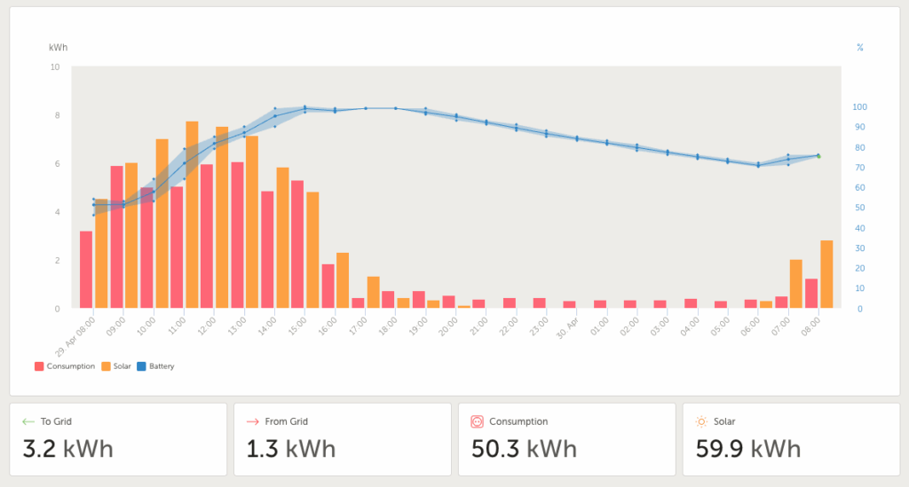
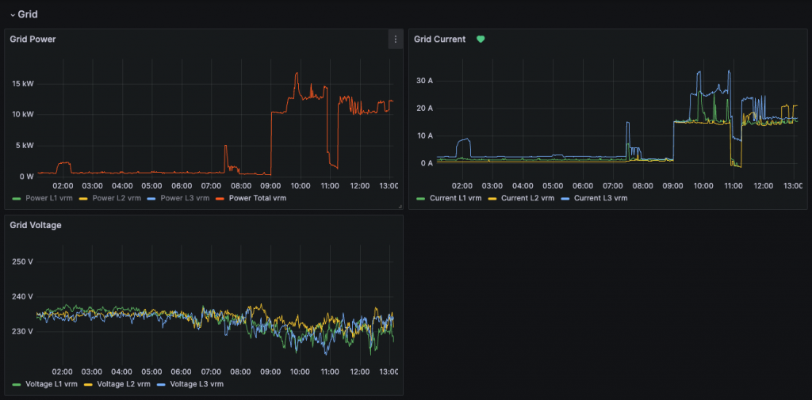

**Ons huis is uitgerust met tal van elektrische apparaten, waaronder een warmtepomp en twee elektrische auto's. Om deze apparaten efficiënt te gebruiken, passen we slimme technieken toe. Op deze pagina leggen we uit hoe we energie meten, analyseren en sturen om zo duurzaam te leven.**

## Energieopwekkers en opslag

Door de batterijopslag en de zonnepanelenomvormers te ontkoppelen, kunnen we de capaciteit van beide systemen onafhankelijk van elkaar schalen. Dit biedt meer flexibiliteit bij toekomstige aanpassingen, zoals het uitbreiden van de batterij of het verplaatsen ervan naar een andere locatie.

- **PV Zuid-Oost**: Fronius Symo 8.2-3-m (8.2kW) + 9.200Wp Zonnepanelen ZO-opstelling

- **Batterij** **\+ Omvormer**: 3x Victron Multiplus II 48/3000/35-32 + 25kWh Pylontech LiFePo4 batterijen

Het gaat om een 48V-batterijsysteem dat volledig functioneert met drie omvormers van telkens 3 kW per fase. Deze complete installatie maakt het mogelijk om de opgewekte energie van onze zonnepanelen op te slaan en te gebruiken tijdens de avond, nacht en ochtend. Bovendien stelt het systeem ons in staat om volledig off-grid te gaan bij een stroomonderbreking.

{: width="450" }

{: width="450" }

{: width="450" }

## Grootverbruikers

Al onze grootverbruikers zijn 3-fase aangesloten om het vermogen zo goed mogelijk te verdelen over de verschillende fases.  
Doordat we ook over twee elektische wagens beschikken (Skoda Enyaq iV 80 / Opel Corsa E), is er zowel binnen is buiten een elektische laadpaal voorzien.

- **Warmtepomp**: Thermia Calibra Cool 7kW (Warm Water + Vloerverwarming/Vloerkoeling)

- **Laadpaal** **buiten**: Etrel Inch Pro 22kW

- **Laadpaal** **binnen**: Loxone Wallbox 11kW

- **Kookplaat**: Bora Pure

## Energie Management

Dankzij ESS-software kunnen we overtollige zonne-energie opslaan en inzetten wanneer dat nodig is. Zo wordt ons energieverbruik volledig zelfvoorzienend. Met eigen ontwikkelde softwarecomponenten zorgen we er bovendien voor dat het capaciteitstarief bij netafname tot een minimum beperkt blijft.

Met Loxone optimaliseren we het gebruik van deze opgeslagen energie. Onze elektrische auto's worden bijvoorbeeld alleen geladen wanneer er voldoende zonne-energie is, en onze warmtepomp past zijn werking aan op basis van de beschikbare energie.

Om ons sluimerverbruik te minimaliseren, schakelt Loxone bij afwezigheid verschillende apparaten via geschakelde stopcontacten volledig uit.

### **Resultaat** van goed energiemanagement

Hieronder kan je goed zien dat ons verbruik _(rode balkjes)_ in lijn ligt met het beschikbare PV vermogen _(orange balkjes)_.

## Energie Monitoring

### NodeRed + InfluxDB + Grafana

Ons energiesysteem beschikt over een geautomatiseerd dataloggingproces dat diepgaand inzicht biedt in het energieverbruik. Node-RED fungeert als datacollector en registreert in real-time alle relevante verbruiksgegevens. Deze data wordt opgeslagen in een tijdreeksdatabase (InfluxDB) en visueel weergegeven via Grafana.

Dankzij deze gestructureerde aanpak kunnen we complexe verbruikspatronen identificeren en proactief optimalisaties doorvoeren om de energie-efficiëntie te verhogen. De Node-RED-flow is zo ontworpen dat ze de normale werking van het systeem niet beïnvloedt, maar enkel actief wordt bij wijzigingen of updates.

{: width="250" }

### PVOutput

Verder maken we constant gebruik van PVOutput.org om onze verbruiks en PV-data naar weg te schrijven.

Onze zonnepanelen-data is publiekelijk te raadplegen op [https://PVOutput.org/list.jsp?sid=96143](https://pvoutput.org/list.jsp?sid=96143).

{: width="250" }

## Dynamisch Energietarief

Door te kiezen voor het dynamische energietarief van Ecopower, ben ik er in geslaagd mijn elektriciteitskosten met bijna de helft te verlagen. Door mijn energieverbruik aan te passen aan de uurlijkse prijsschommelingen, profiteer ik optimaal van de laagste tarieven. Dit betekent dat ik mijn wasmachine, vaatwasser en elektrische auto vooral 's nachts laat draaien, wanneer de elektriciteit het goedkoopst is of wanneer er een overschot is aan PV-energie.

