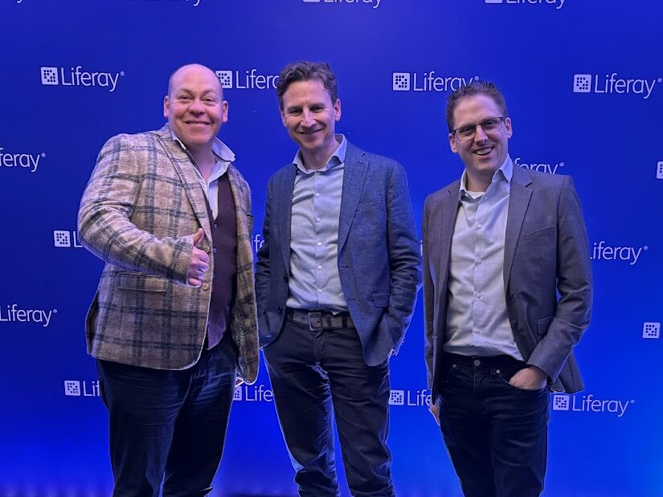
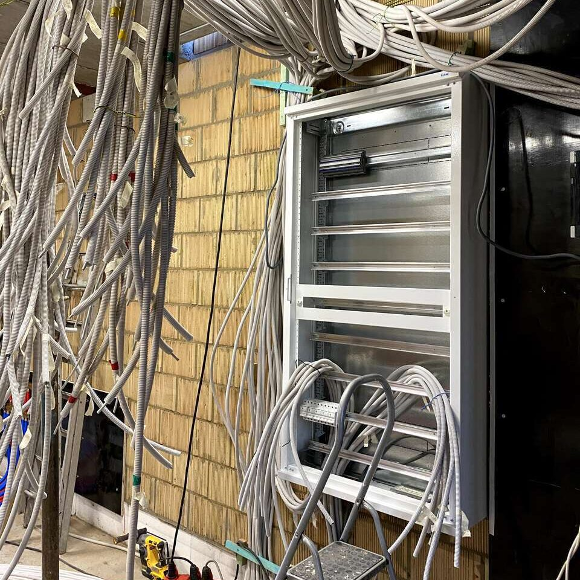
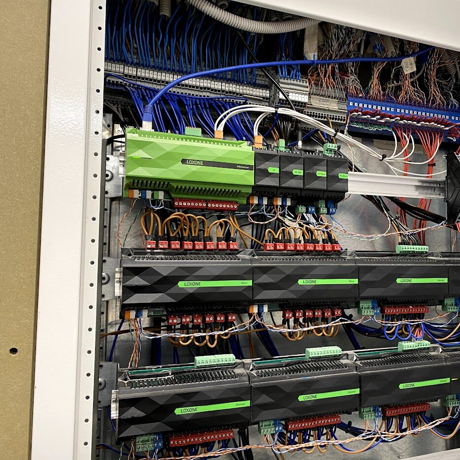
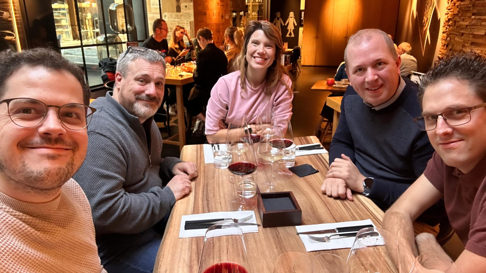
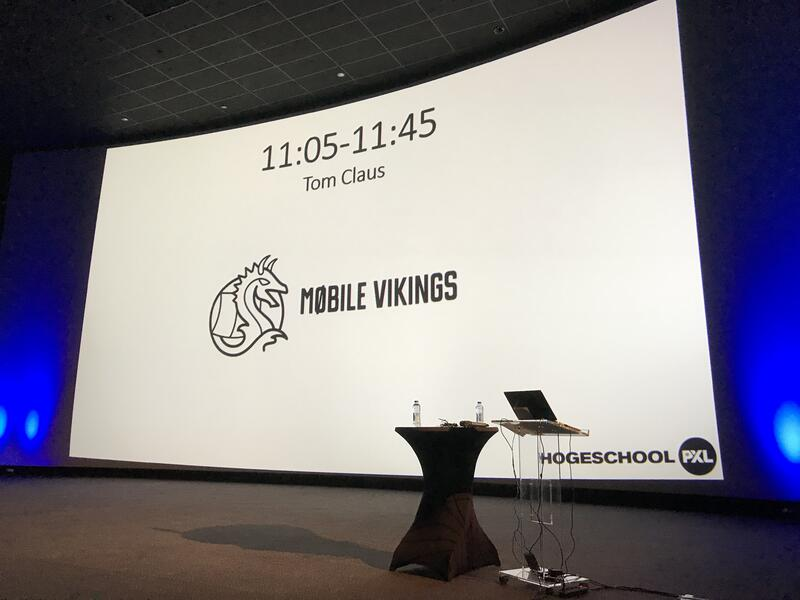
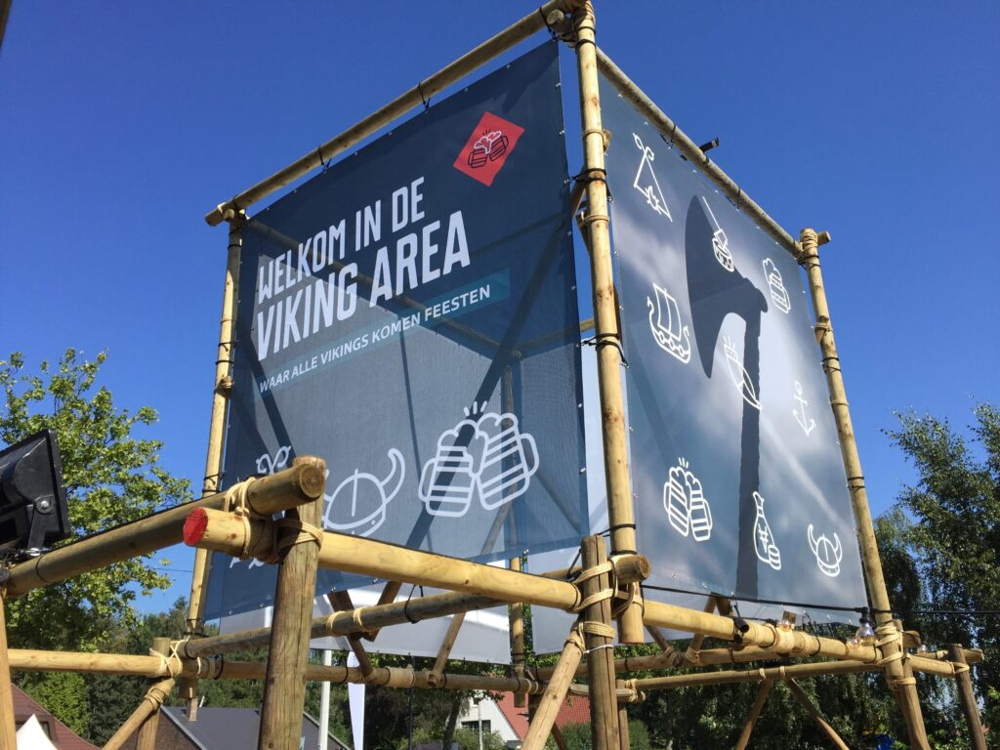
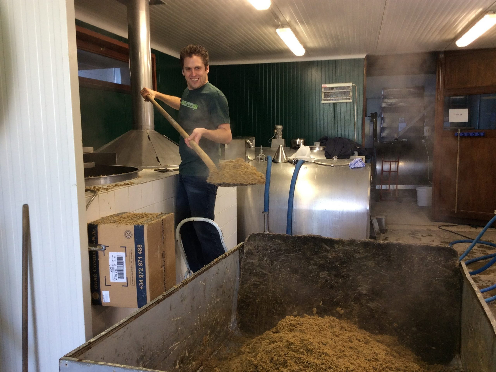
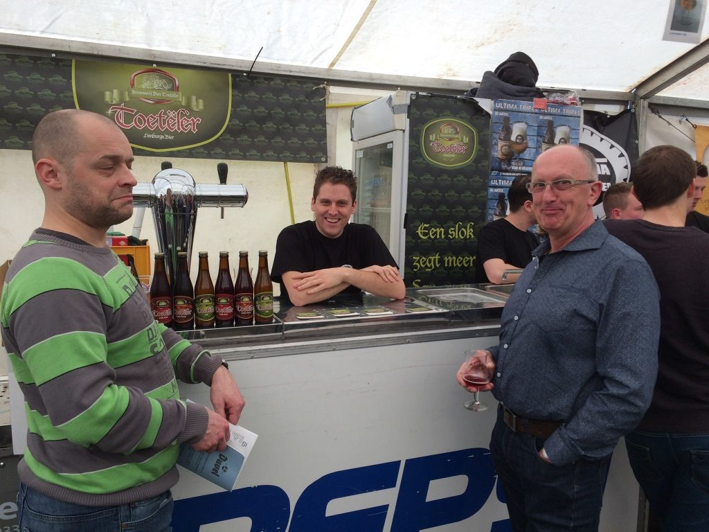
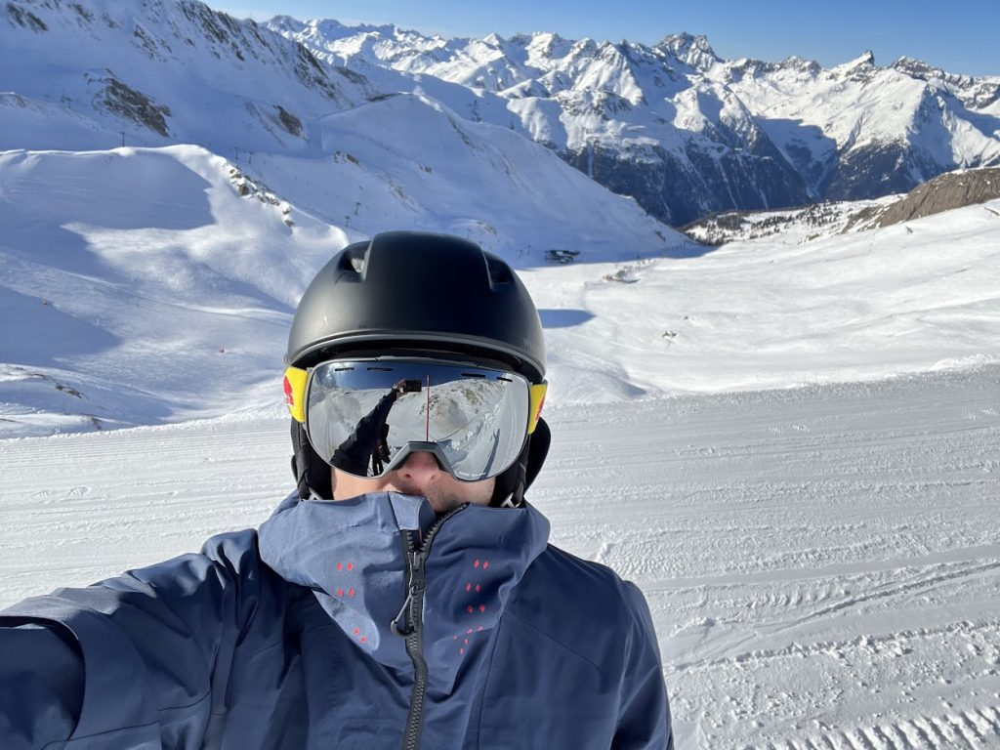

# Tom Claus

Hallo, ik ben Tom Claus! Met 15 jaar ervaring in de IT-sector heb ik een sterke reputatie opgebouwd in het opzetten en succesvol leiden van complexe webprojecten. Bij organisaties zoals [Mobile Vikings](https://mobilevikings.be/nl/?referral=fee40957ef), [Cake.app](https://ibsintelligence.com/ibsi-news/levenue-acquires-cake-secures-e8m-in-series-a-from-truffle-capital/) en [ACA Group](https://acagroup.be/nl/auteur/tom-claus/?utm_source=tomclaus&utm_medium=website&utm_campaign=about-page) heb ik mijn expertise in projectmanagement, business development en leiderschap verder verfijnd. Naast mijn professionele focus werk ik ook aan projecten rond home automation en energy management, waarbij ik technologie inzet om efficiëntere en duurzamere oplossingen te creëren. 

Mijn kennis en ervaring probeer ik de te delen in [deze blog](/). De hier geuite meningen en standpunten zijn die van mijzelf en niet verbonden aan mijn werkgever(s). Heb je vragen of opmerkingen, dan kan je [mij contacteren](https://tomclaus.be/contact/).

## Mijn loopbaan, historiek & projecten.

**ACA GROUP / BUSINESS UNIT MANAGER  
**_2024 - heden, _Hasselt__  
Als Business Unit Manager DXP & CMS bij ACA Group geef ik leiding aan een team van ervaren ontwikkelaars en projectmanagers. Samen streven wij ernaar de verwachtingen van de klant te overtreffen en nieuwe normen te stellen in de CMS & DXP-sector door middel van innovatieve en hoogwaardige oplossingen.

* * *

**ACA GROUP / SENIOR PROJECT MANAGER  
**_2023 - 2024, _Hasselt__  
Binnen de Business Unit DXP & CMS beheerde ik verschillende complexe projecten in content & information Management, dit zijn projecten die erop gericht zijn informatie in een bedrijf samen te brengen en zichtbaar te maken voor interne medewerkers, klanten en/of leveranciers. Dit gebeurt door de ontwikkeling van sites zoals een intranet klanten- of partnerportaal. Ik was verantwoordelijk voor een nauwgezette planning, toewijzing van middelen en het bevorderen van de samenwerking tussen teams. Ik gaf prioriteit aan open communicatie met klanten om oplossingen op hun behoeften af te stemmen en uitzonderlijke resultaten te behalen.

* * *

**ENERGY EMS INSTALLATIES & LOXONE BEGELEID ZELFBOUWEN / ZAAKVOERDER  
**_2021 - heden, _Diepenbeek__  
Verantwoordelijk voor de installatie van geavanceerde domotica- en batterijsystemen, geïntegreerd met intelligente en geoptimaliseerde energiebeheersystemen (Loxone, KNX, Victron, …). Gericht op de slimme aansturing van laadprocessen en het efficiënt gebruik van (zonne-)energie om het eigen verbruik te maximaliseren. Daarnaast zet ik mijn expertise in om zelfbouwers te ondersteunen bij de realisatie van hun droomhuis. Door middel van gedetailleerde documentatie, persoonlijke begeleiding en een zorgvuldig geselecteerde materiaallijst, stelde ik zelfbouwers in staat om zelf domotica, smart-home oplossingen en hernieuwbare energie te integreren.

* * *

**CAKE / CO-FOUNDER & HEAD OF BUSINESS DEVELOPMENT  
**_2018 - 2023, _Hasselt__  
In 2018 heb ik samen met een team van 4 mede-gepassioneerde ondernemers Cake.app opgericht, een revolutionair advertentieplatform dat de manier waarop retailers hun klanten bereiken volledig heeft veranderd. Na een periode van intensieve productontwikkeling en marktintroductie, heb ik een sterk salesteam gebouwd om onze groei te versnellen. Met succes hebben we toonaangevende bedrijven overtuigd van de kracht van ons platform, wat uiteindelijk heeft geleid tot de [overname door Levenue in 2023](https://ibsintelligence.com/ibsi-news/levenue-acquires-cake-secures-e8m-in-series-a-from-truffle-capital/).

* * *

**MOBILE VIKINGS / HEAD OF VIKING DEALS**  
_2016 - 2018, _Hasselt__  
Als verantwoordelijke voor het [loyalty/cashback platform bij Mobile Vikings](https://mobilevikings.be/nl/viking-deals/?referral=fee40957ef) heb ik baanbrekende concepten ontwikkeld in samenwerking met toonaangevende partners zoals Coolblue, Bol.com en Zalando. Samen met een team van 6 specialisten op het gebied van ontwikkeling, marketing en sales heb ik innovatieve oplossingen geïmplementeerd die de klantloyaliteit aanzienlijk hebben vergroot en ons bedrijf een unieke positie in de markt hebben gegeven.

* * *

**MOBILE VIKINGS / DIGITAL MARKETEER**  
_2014 - 2016, _Hasselt__  
Ik was medeverantwoordelijk voor de dagdagelijkse marketing en evenementen van Mobile Vikings. Ik had daarnaast ook de titel van Technology Evangelist, waarmee ik onze interne kennis ging verspreiden op verschillende conferenties en bij tal van scholen.

* * *

**MOBILE VIKINGS / FULL STACK DEVELOPER**  
_2012 - 2014, Hasselt  
_Ik was een full-stack developer en heb verschillende projecten mee vorm gegeven waaronder de opstart van Mobile Vikings en Viking Spots.

* * *

## Opleidingen, Certificaten,...

**LIFERAY BUSINESS SALES CERTIFICATION**  
_2024, Hasselt  
_Ik heb het Liferay Business Sales Certification behaald, waarmee ik mijn expertise heb versterkt in het verkopen van Liferay’s digitale platformen. Dit omvat vaardigheden in het herkennen van klantbehoeften, het bieden van passende oplossingen en het succesvol afronden van verkooptrajecten.

* * *

**EASA / DRONE VLIEGBEWIJS A1/A3  
**_2023, Brussel  
_Opleiding en examen voltooid van het Europese A1/A3 drone vliegbewijs. Dit examen bevat alles omtrent luchtvaartregelgeving en luchtruimbeperkingen, operationele procedures, vluchtplanning en de algemene kennis over drones.

* * *

**SYNTRA LIMBURG / ZYTHOLOOG  
**_2014 - 2016, Hasselt  
_Opleiding tot Zytholoog: een gedegen bierdeskundige die de rol van biersommelier vervult. Na deze opleiding heb ik ook enkele jaren meegewerkt in Brouwerij Den Toetëlèr te Hoeselt als bierbrouwer.

* * *

**PADI OPEN WATER - DUIKBREVET**  
_2015, Cozumel - MExico  
_Theoretisch examens en praktijk opleiding voltooid in het lokale zwembad te Bilzen, het eind-examen voor een Open Water duikbrevet (PADI) behaald in Cozumel, Mexico.

* * *

## Ontspanning & Hobby's

**SPORTEN - SKIËN / LOPEN / ROEIEN**  
Als hobby hou ik me bezig met sporten zoals skiën, lopen en (indoor) roeien.  
Enkele verwezelijkingen zijn de Midnight Sun Marathon (42km) in Tromsø, Noorwegen uitlopen. Daarnaast ook de Fisherman's Friend StrongmanRun, een crosscountry competitie over lange afstand met verschillende hindernissen die al klimmend, kruipend, springend genomen moeten worden

## Socials

- [**x.com**/tom](https://x.com/tomclaus)[claus](https://x.com/tomclaus)

- [**linkedin.com**/in/claustom](https://www.linkedin.com/in/claustom/)

- [**bsky.app/**profile/tom.claus.social](https://tom.claus.social)

## Contact

**ZUPAH BV  
**_t.a.v. zaakvoerder Tom Claus  
_Lutselusstraat 129  
3590 Diepenbeek  
België

**Email**: [mail@tomclaus.be](mailto:mail@tomclaus.be)

## Financiële gegevens

**BTW**: BE 0767.830.422  
**Ondernemingsnr.**: 0767.830.422
