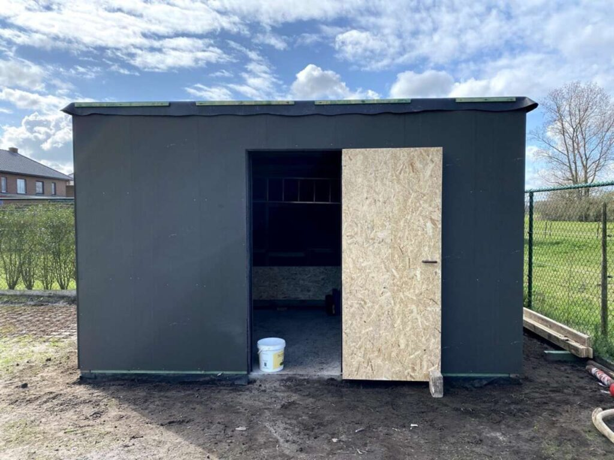

Ondertussen zijn de DWD platen tegen het keperwerk geplaatst. Deze dampopenplaat is tegen de regen, maar kan toch het vocht uit het tuinhuis te krijgen.

Onderaan komt een Trespa plint over de onderste houten constructie balk , alsook een stuk over het beton. Op die manier kan de balk geen water opnemen.

Ondertussen is er ook verder gewerkt aan de afwerking van de deur. Dit nam evenveel tijd in beslag als het volledige tuinhuis voorzien van DWD platen. De deur is voorzien aan de buitenkant van een DWD plaat, aan de binnenkant een OSB plaat, inox scharnieren alsook een als een steekt- en cilinderslot uit inox.

In een [2de fase](https://bouw.tomclaus.be/wanden-ayous/) zal hier een Ayous afwerkinglat tegen komen (met 1cm spatie tussen de latten). Op die manier krijgen we dan een mooie combinatie tussen het Ayous hout en de zwarte achtergrond,

## Materiaal:

- 24x Agepan DWD black platen (250cm x 62,5cm, 16mm dik)

- 350 Spaanplaatschroeven 4x50mm

- 14m x 10cm HPL (Trespa) zwart 6mm

- 4x inox scharnier

- 1 insteekslot

- 1 cilinderslot (voorzie dit zeker lang genoeg, keperwerk + plaat binnenkant + plaat buitenkant)

