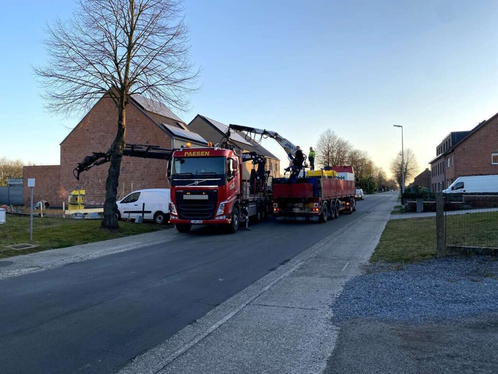
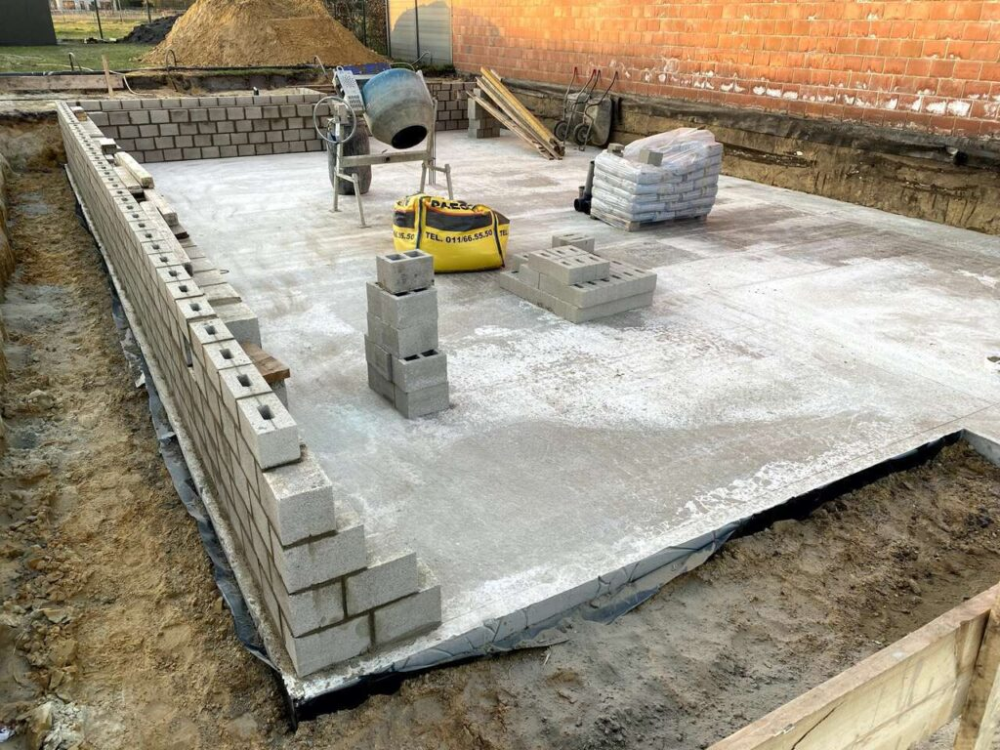
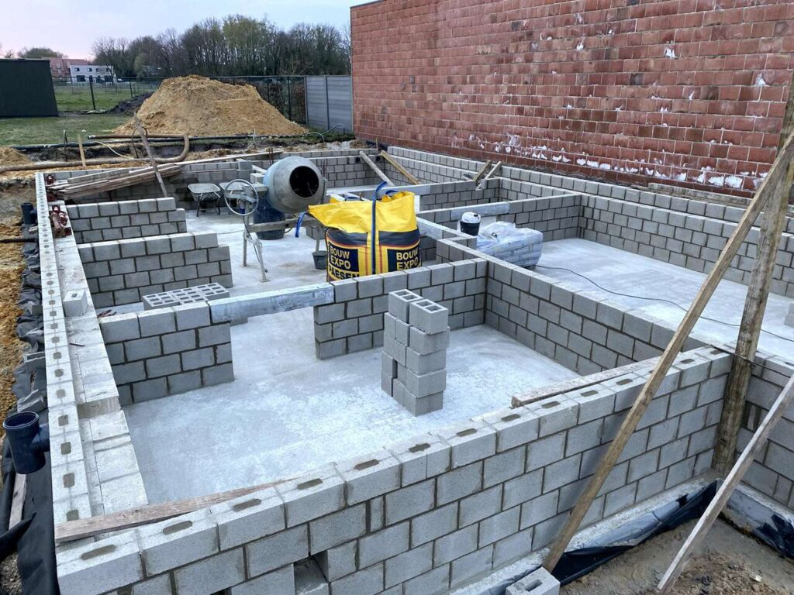
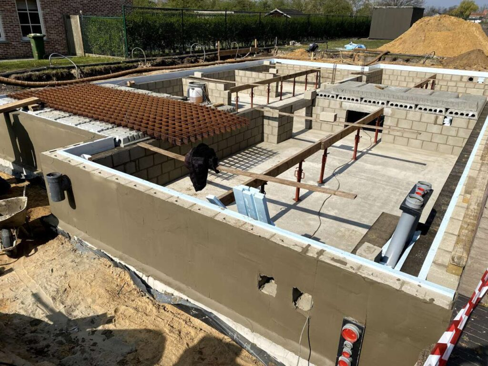
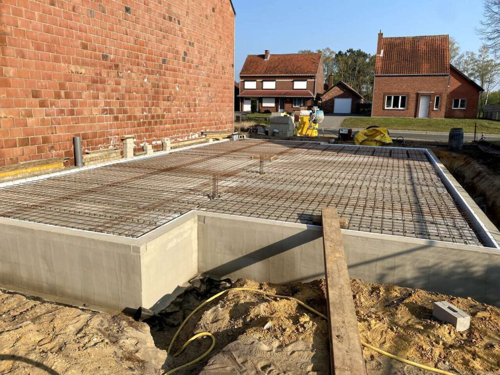
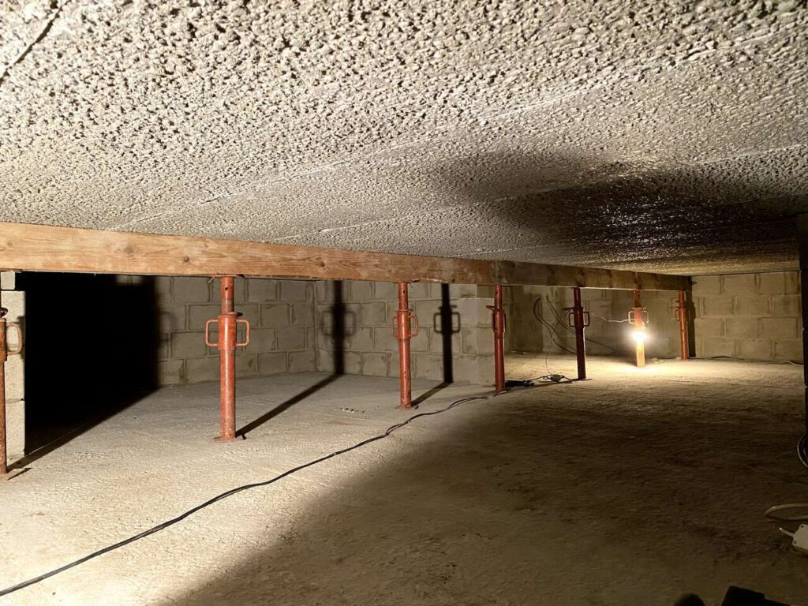

Na 2 dagen muren metselen, één dag afwerken (cementeren etc.) en de welfsels plaatsen, is vandaag de druklaag gestort op onze kruipkelder.

Verder hebben we ondertussen ook een drainagebuis rond de kruipkelder geplaatst in de hoop onze kruipkelder zo droog te houden van de hoge grondwaterstand.

