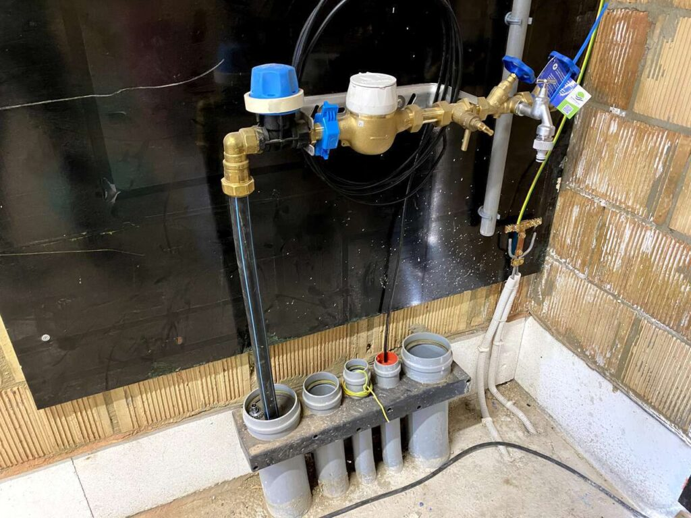

Omdat er stromend water nodig was voor de [warmtepomp boring](https://bouw.tomclaus.be/warmtepomp-boring/), hadden we al de Watergroep aansluiting laten plaatsen inclusief definitieve meter.

Verder komen ze binnen enkele dagen ook onze zonnepanelen op het dak plaatsen. Hiervoor hebben we besloten een tijdelijke opstelling binnen te maken waarop deze aangesloten kunnen worden. Hiervoor kwam Fluvius dan ook onze definitieve meter binnen plaatsen. Ze hebben ineens ook de coax kabel aangesloten.

Bye Bye [werfkast](https://tomclaus.be/bouw/bouw-huis/de-werfkast-is-aangesloten/)!

