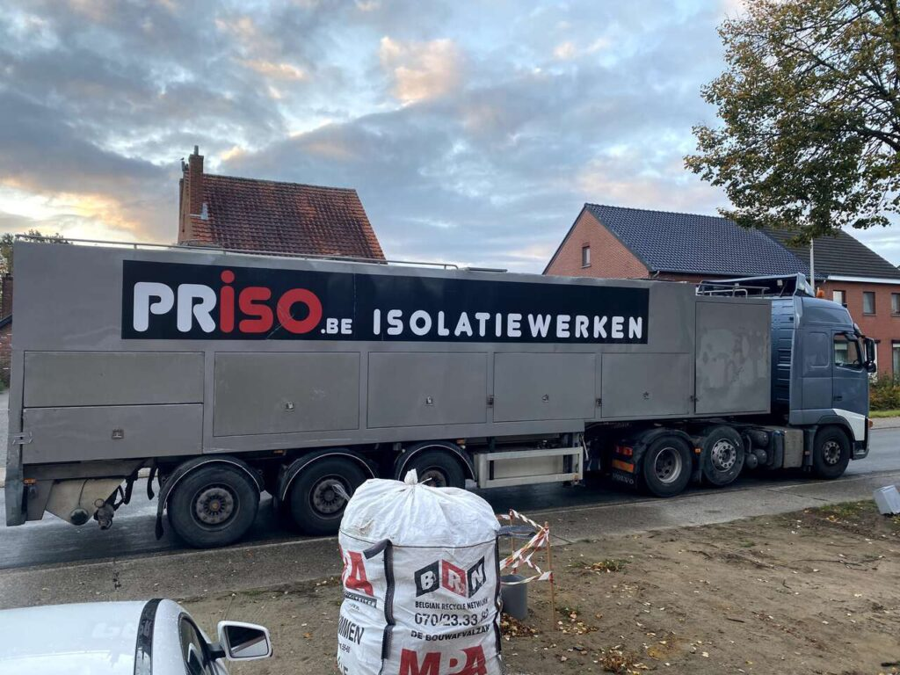
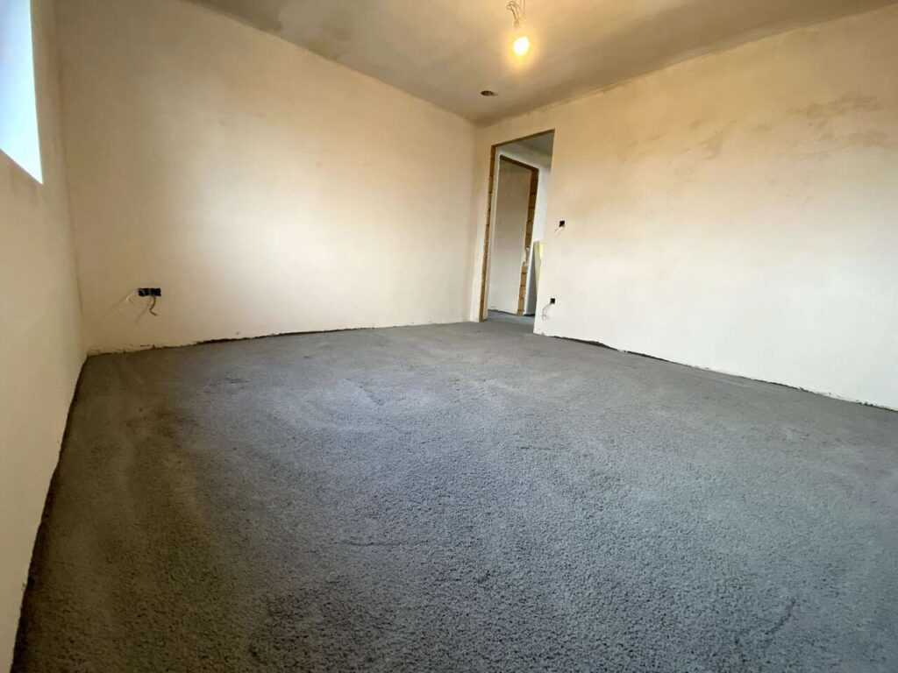
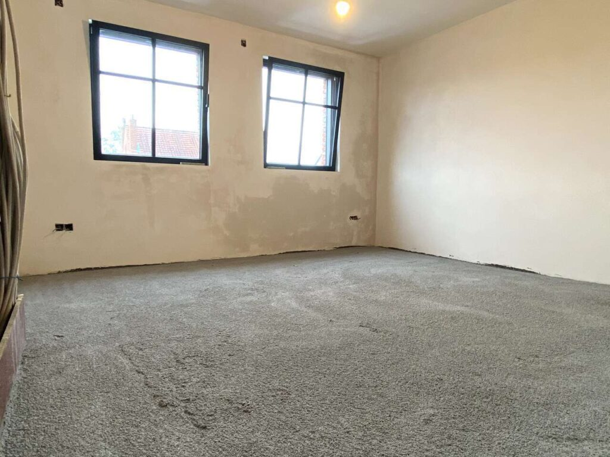
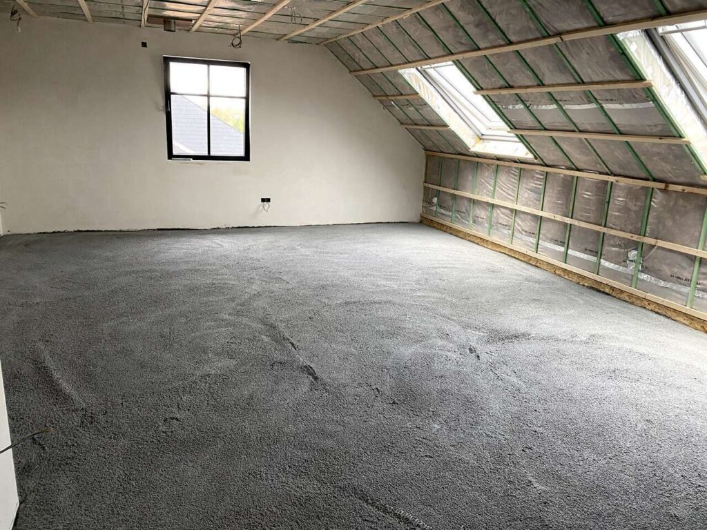
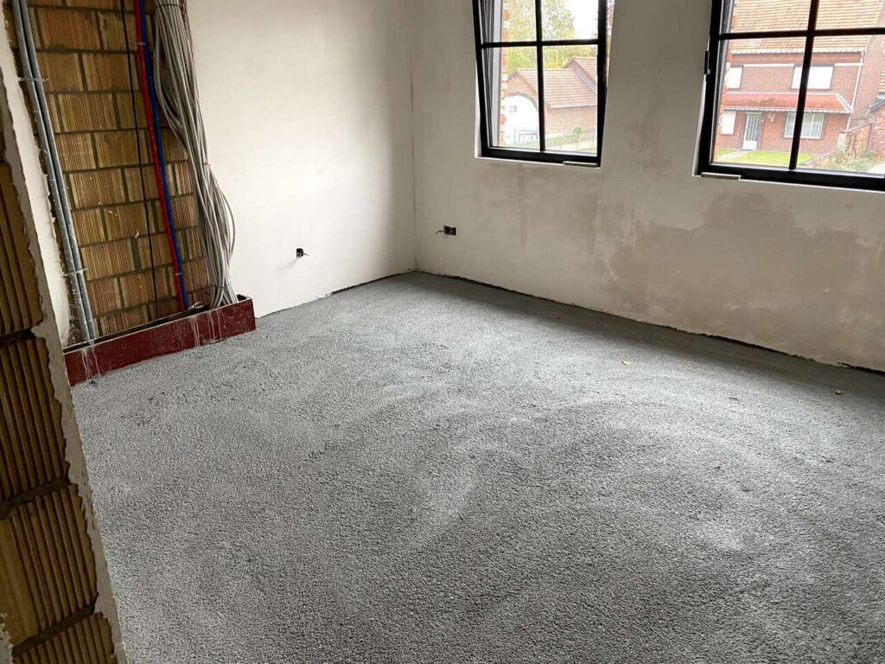
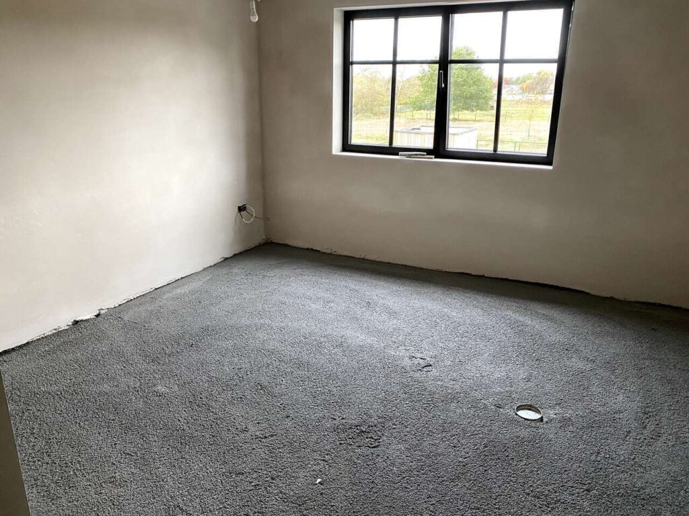
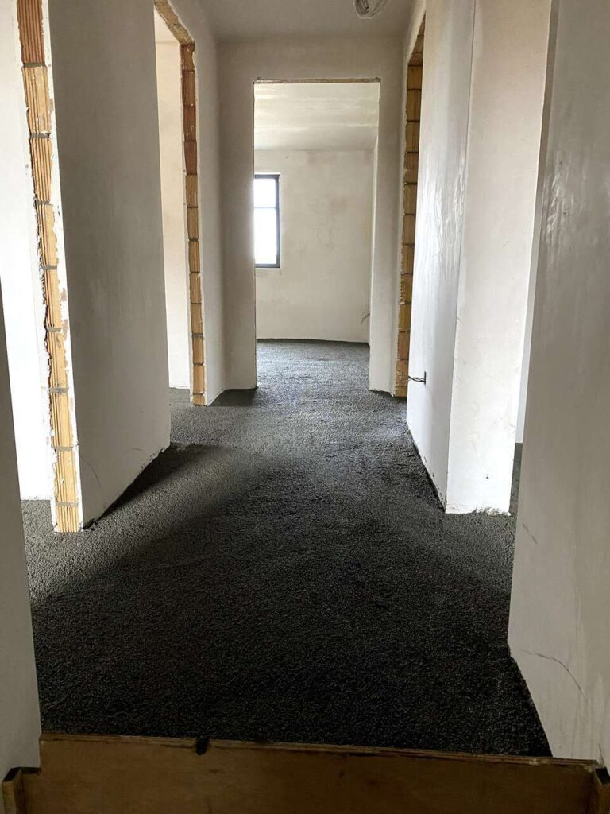

De werken volgen elkaar goed op! Vrijdag waren nog de laatste pleisterwerken bezig en vandaag zijn ze de isolatiechape al komen plaatsen. Een werkje dat op een voormiddag afgerond was voor onze 2 verdiepingen.

Deze isolatiechape is enkel op de verdiepingen geplaatst, want daar zaten we met een te hoge vloeropbouw door onze ventilatiebuizen en afvoeren. _(Beneden is er al een uitvulchape geplaatst waarop volgende week isolatieplaten plaatsen.)_

Als isolatiechape hebben we gekozen voor [Isopearls EPS parels](http://www.isopearls.be/eps-vloerisolatie/) met een zeer lage Lambda-waarde (0,033W/m.K). De werken werden uitgevoerd door [Priso](https://www.priso.be/).

