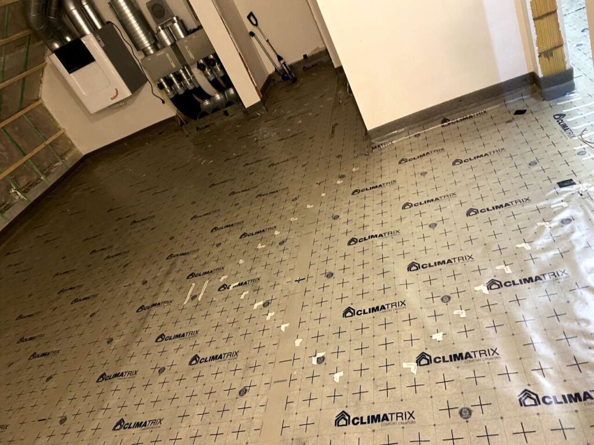
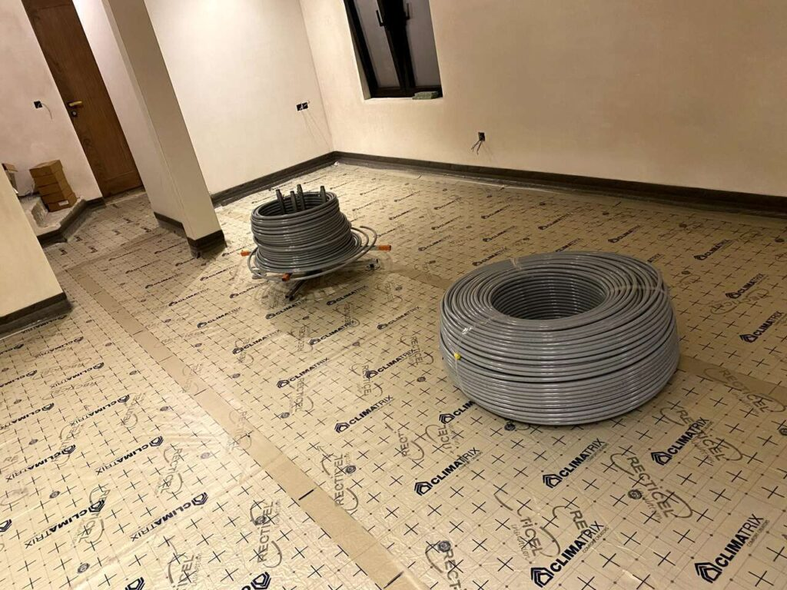
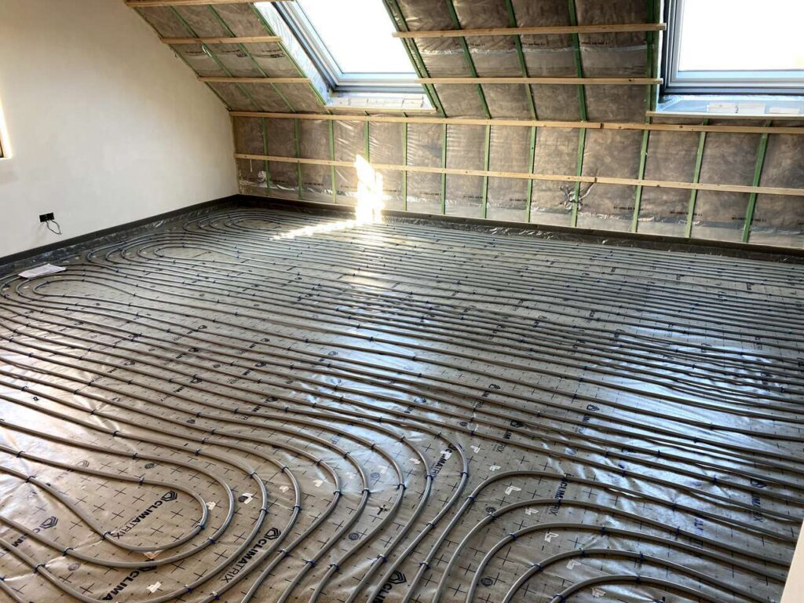
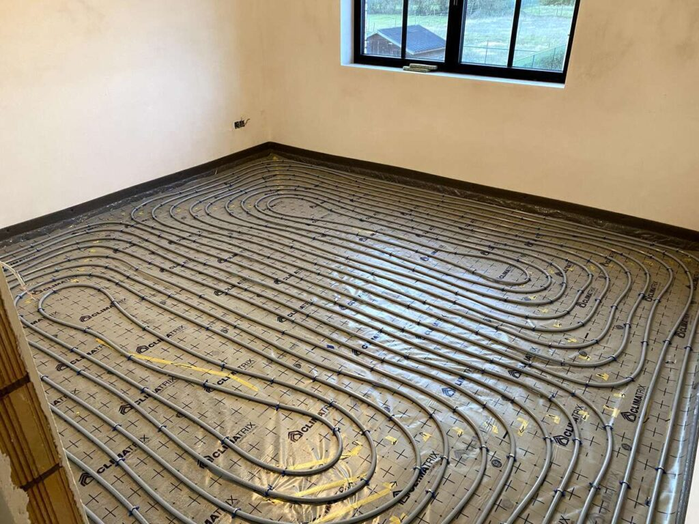
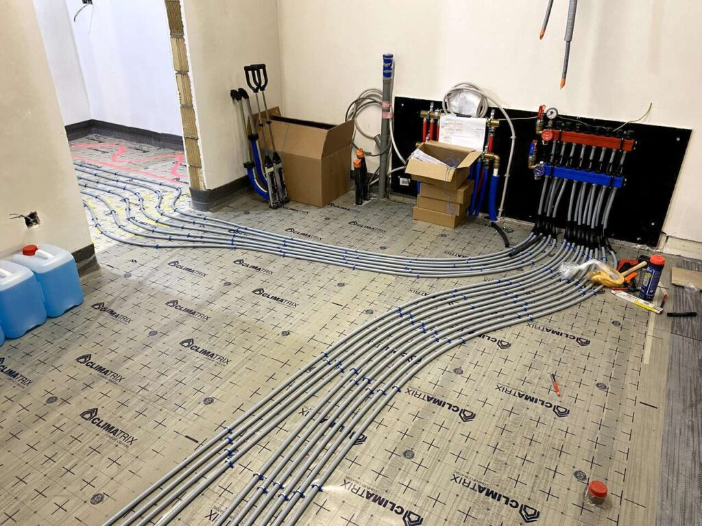

Tijdens het verlengde weekend van 11 november hebben we enkele dagen vloerverwarming geplaatst. We hebben op de 3 verdiepingen overal voerverwarming (enkel de garage niet), een heel werkje dus om de chapeband, rasterfolie en uiteindelijk 1.800m vloerverwarming buisjes geplaatst te krijgen.

