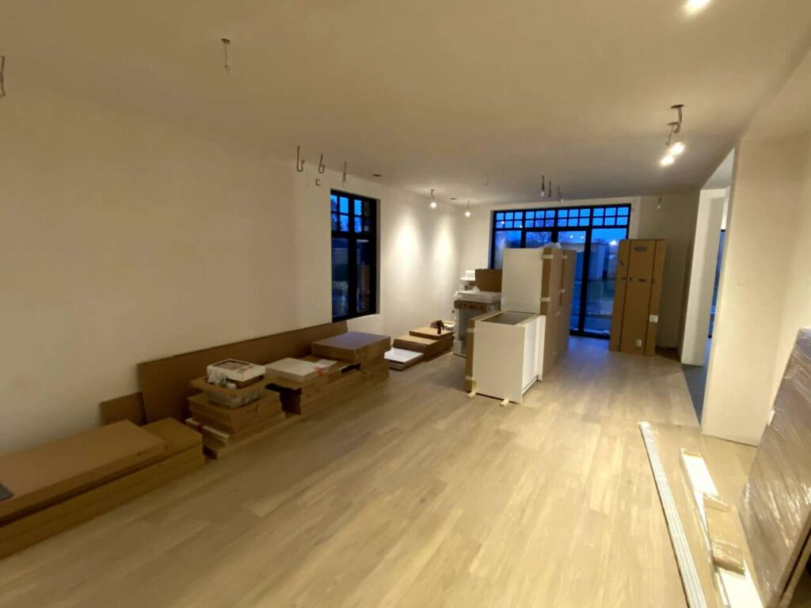
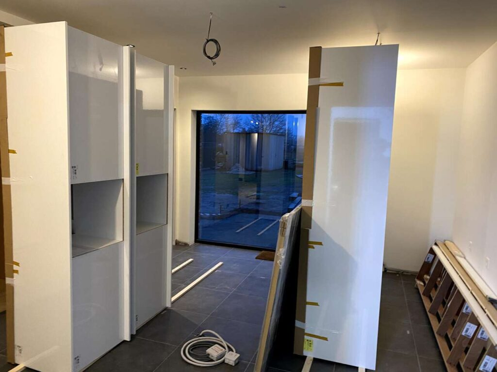
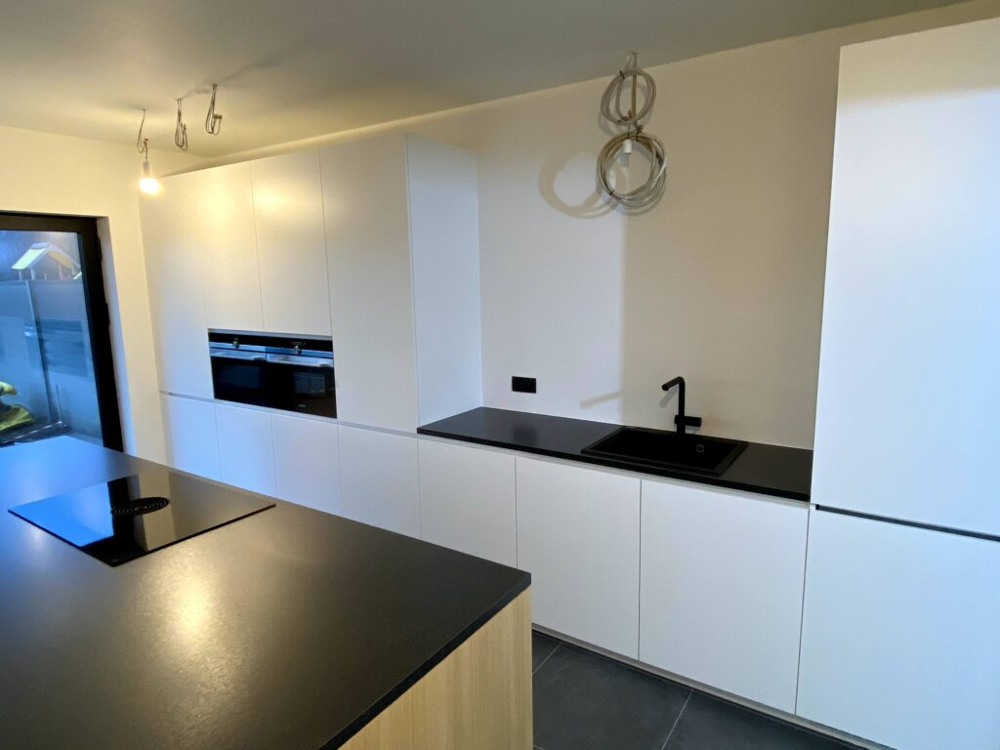
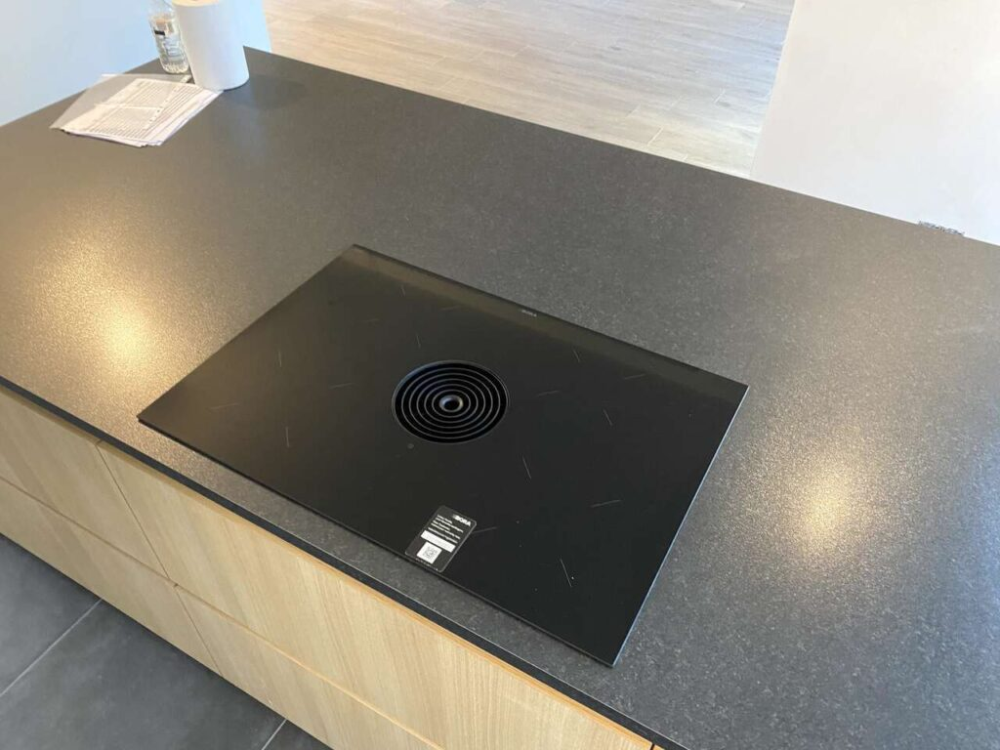
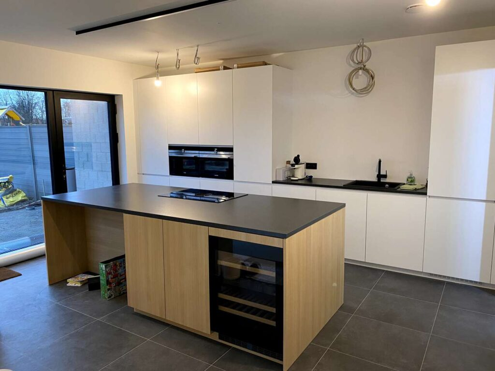

De afgelopen 2 dagen is Dovy Keukens ze onze keuken komen plaatsen.

We [hebben gekozen](https://tomclaus.be/bouw/bouw-huis/de-keuken-is-besteld/) voor een half glanzende witte kastenwand met zwart werkblad. Hierin zit dan ook onze spoelbak. In ons keukeneiland, dat afgewerkt is met lichte eik kleuren en zwart werkblad, zit dan onze kookplaat met recirculatie dampkap.

Verder hebben we ook de volgende toestellen voorzien:

- **Kookplaat:** [Bora Pure met ingebouwde recirculatie dampkap](https://www.bora.com/int/en/cooktop-extractor/bora-pure/)

- **Oven:** [Siemens CB675GBS3](https://www.siemens-home.bsh-group.com/be/nl/productlijst/koken-en-bakken/oven/compacte-oven/CB675GBS3)

- **Microgolfoven:** [Siemens CF634AGS1](https://www.siemens-home.bsh-group.com/be/nl/productlijst/koken-en-bakken/microgolfoven/inbouw-microgolfovens/CF634AGS1)

- **Koelkast:** [Siemens KI81RVSF0](https://www.siemens-home.bsh-group.com/nl/productoverzicht/koelen-en-vriezen/inbouw-koelkasten-en-vriezers/inbouw-koelkasten/KI81RVSF0)

- **Vaatwasser:** [Siemens SN778D86TE](https://www.siemens-home.bsh-group.com/be/nl/productlijst/dishwasherscn/dishwasherscnbuiltin/dishwasherscnbuiltinfullsizedishwashers/dishwasherscnbuiltinfullsizedishwashersfullyintegrated/SN778D86TE)

- **Wijnkast:** [Liebherr UWTgb1682](https://www.liebherr.be/wijnkasten/wijn-inbouw/uwtgb-1682-20/)

- **Spoeltafel:** [Franke Fiji FIG 610 580 Fragranit+ Onyx](https://www.franke.com/be/nl/ks/producten/spoeltafels/fiji/fig610580ox1_detail.html)

- **Keukenkraan:** Paffoni Ringo RIN 185 NO Mat Zwart

De bovenkant van de keukenkasten gaan we nog afwerken met MDF om dit mooi strak met de deurtjes te laten vallen.

