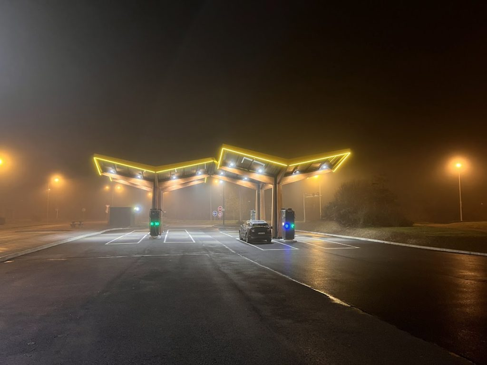
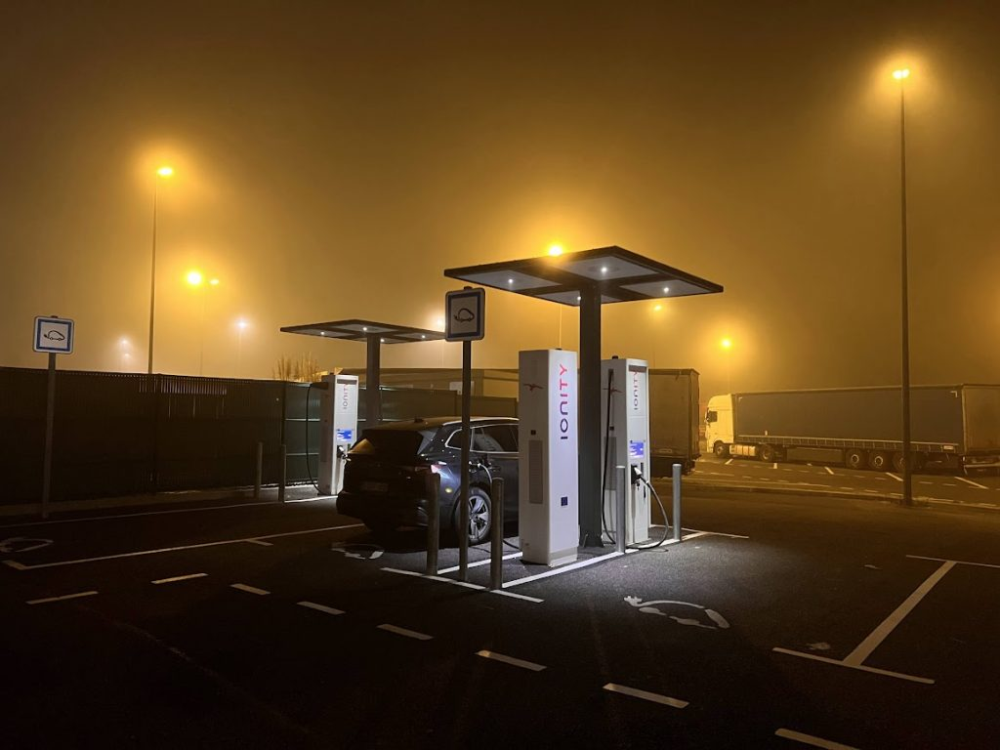

Voor onze eerste lange reis met een elektrische auto naar Val Thorens in Frankrijk _(950 km heen, 2.300 hoogtemeters)_, besloot ik me goed voor te bereiden. Omdat ik niet helemaal vertrouwde op de ingebouwde GPS, installeerde ik de ABRP-app en nam ik meteen een [Premium-abonnement](https://abetterrouteplanner.com/premium/?referral=ZCARXKQR). Dankzij mijn OBD-dongle kon mijn iPhone communiceren met de auto, waardoor ABRP live data kon ontvangen en laadstops kon aanpassen aan mijn verbruik. Het Premium-abonnement bood extra features, zoals CarPlay.

_Via [deze link](https://abetterrouteplanner.com/premium/?referral=ZCARXKQR) kun je trouwens 30 dagen gratis van ABRP gebruikmaken, in plaats van de standaard 14 dagen._

## **Heenreis**

Tijdens de heenreis navigeerde ik vooral met de ABRP-GPS. Deze gaf op basis van mijn actuele verbruik netjes aan waar ik moest stoppen en hoeveel ik moest opladen. Soms was het zo zelfs voordeliger om tot 65% te laden en een extra stop te maken, gezien de laadsnelheden onderweg.

De GPS voorspelde een totale rittijd van 12 uur, met 10 uur effectief rijtijd en 3 uur laadpauzes. Onze eerste twee stops waren bij Tesla-superchargers. In Wallonië zijn er helaas weinig laadpalen, en bij Tesla hebben ze te korte laadkabels, waardoor je soms dwars moest parkeren. Ondanks de hoge laadsnelheid verloor ik wel veel tijd met het opstarten van de sessie via de app. Een badgesysteem zou hier veel handiger zijn.

De rest van de laadstops waren bij Fastnet of Ionity. Hier hadden we weinig tot geen problemen en stonden we meestal zelfs alleen. We konden overal onze Shell Recharge-badge gebruiken, die in heel Europa werkt.

Na exact 12 uur en 5 laadstops van gemiddeld 20-30 minuten kwamen we aan in Val Thorens. De laadstops voelden helemaal niet aan als tijdverlies; integendeel, we waren door de pauzes uitgerust toen we aankwamen.

## **Oplaadmogelijkheden in Val Thorens**

In de parkeergarage van ons verblijf waren verschillende laadpalen beschikbaar, waardoor we de wagen perfect konden opladen tot 90%. Regeneratie bergafwaarts maakt laden tot 100% niet nodig.

## **Terugreis**

Voor de terugreis gebruikten we de ingebouwde Skoda GPS. Deze deed zijn werk uitstekend. We bereikten onze bestemming in 4 stops van 20-30 minuten. In de GPS moet je wel wat dieper duiken om te zien hoe lang je moet laden, maar het werkt prima en is een goed alternatief voor ABRP.

## **Conclusie**

Onze eerste lange reis met een elektrische auto was een succes! Dankzij de goede voorbereiding, met ABRP en de Shell Recharge-badge, verliep alles vlot. De laadstops voelden niet aan als tijdverlies en waren zelfs welkom om even te pauzeren. We zijn zeker van plan om in de toekomst vaker met onze elektrische wagen op reis te gaan.

## **Extra tips:**

- Plan je reis op voorhand en bekijk waar laadpalen beschikbaar zijn.

- Houd rekening met extra reistijd door laadstops.

- Download laadapps van verschillende aanbieders.

- Overweeg een abonnement op een laadnetwerk.

- Laad niet altijd tot 100%, zeker niet bij regeneratieve remmen.

- Neem pauze tijdens het laden om de benen te strekken.

**Ik hoop dat dit verslag je inspireert om ook op reis te gaan met je elektrische wagen!**

