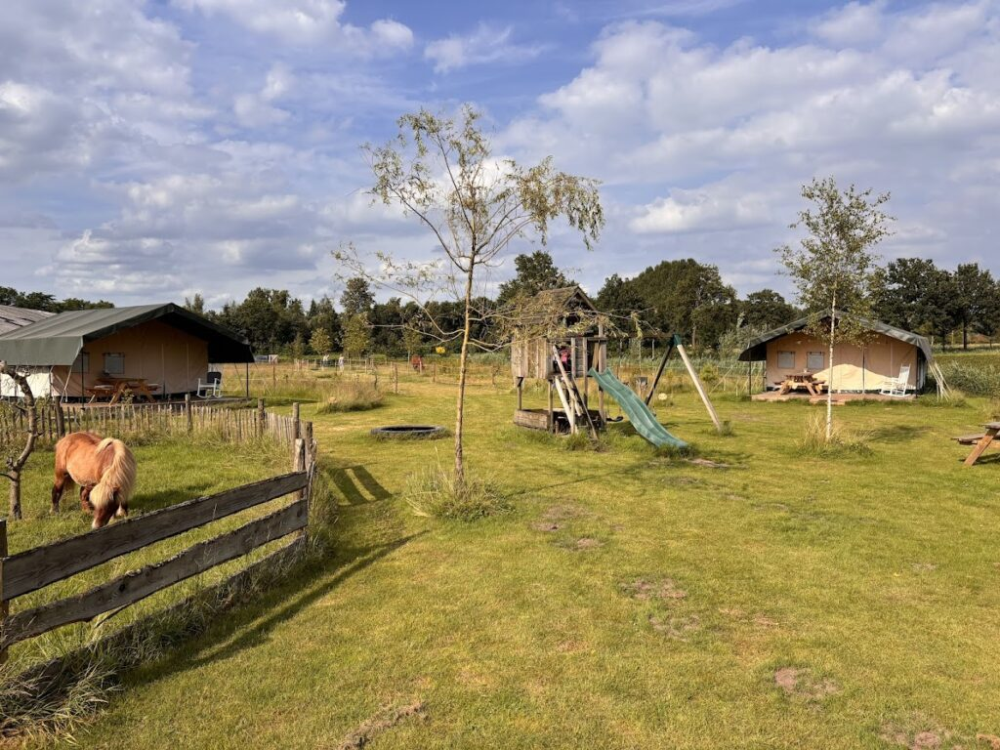
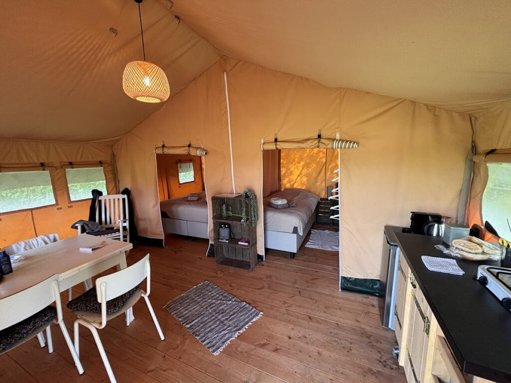
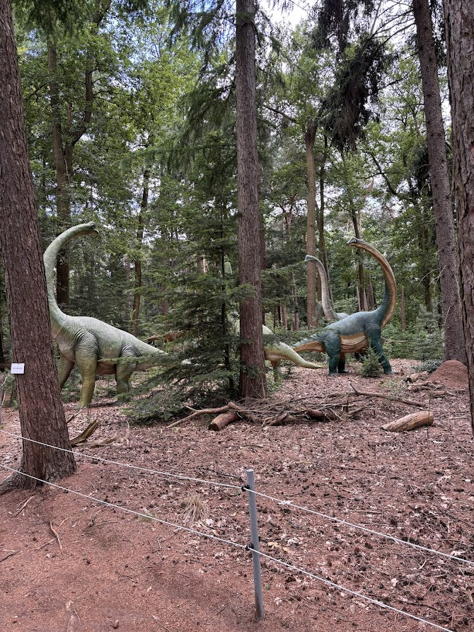
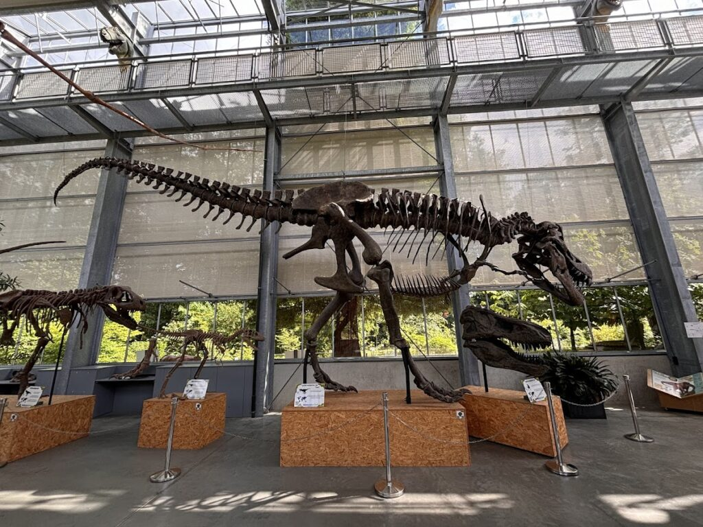
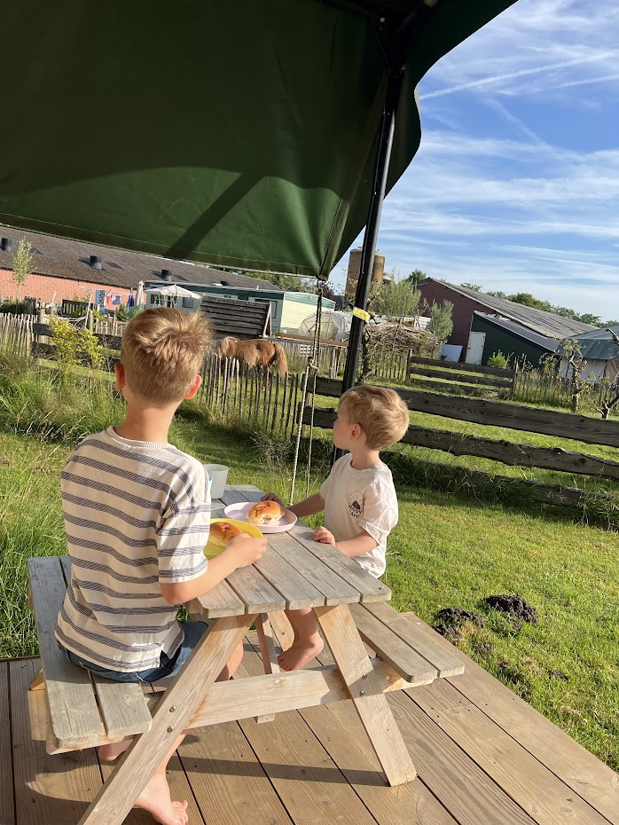

Omdat we zin hadden in een avontuurlijk uitstapje, besloten we afgelopen weekend spontaan een last-minute [glamping](https://www.airbnb.be/rooms/911256322672382053) te boeken. Deze unieke accommodatie in Sint-Oedenrode lag op steenworp afstand van Eindhoven. De omgeving bleek niet alleen te pronken met prachtige natuur, maar bood bovendien tal van leuke kindvriendelijke activiteiten.

Onze glamping was perfect om even helemaal tot rust te komenen de tent was sfeervol ingericht en voorzien van alle gemakken. Terwijl de kinderen zich konden uitleven in de ruime speeltuin, konden mama en papa genietne op het terras van de glamping tent. De paarden die in de buurt graasden zorgden voor een extra idyllische sfeer.

## Kindvriendelijke activiteiten

#### **Naar het Gouden Woud: avontuurlijk spelen en meer in Sint-Oedenrode**

Ons glampingavontuur in Sint-Oedenrode kreeg nog een extra dimensie met een bezoek aan **[het Gouden Woud](https://www.goudenwoud.nl/)**. Deze unieke speelplek onderscheidt zich van traditionele speelboerderijen en biedt urenlang plezier voor kinderen van alle leeftijden.

In het Gouden Woud kunnen kinderen hun fantasie de vrije loop laten. Ze kunnen naar hartenlust graven in gigantische zandbakken of dammen bouwen met waterpompen. De zandbakken herbergen zelfs verborgen schatten: goudklompjes die wachten om ontdekt te worden! Deze glinsterende vondsten kunnen ingewisseld worden voor leuke beloningen, wat voor extra spanning en avontuur zorgt.

#### **Dino's en archeologie**

**[Het Oertijdmuseum](https://www.oertijdmuseum.nl/)** een absolute must-visit. Hier begeven jong en oud zich op een spannende speurtocht door een bos vol levensgrote dinosaurussen. De indoorruimte van het museum biedt boeiende informatie over archeologie en laat kinderen kennismaken met het verleden op een interactieve manier.

#### **Familieplezier in Kienehoef park**

**[Het Kienehoef park](https://www.streekparkkienehoef.nl/)** is een oase van rust en plezier voor het hele gezin. De kinderen kunnen zich uitleven in de ruime speeltuin, terwijl de ouders ontspannen op een terrasje of picknicken in het groen. De kinderboerderij biedt een unieke kans om kennis te maken met diverse dieren, terwijl een ritje op een waterfiets op de vijver voor verkoeling zorgt.

Voor wie na al dat spelen trek heeft gekregen, is **[De Helden van Kien](https://www.deheldenvankien.nl/)** de perfecte plek om te smullen van een heerlijke maaltijd. Dit restaurant serveert diverse gerechten voor jong en oud, terwijl de aparte speeltuin de kinderen volop vermaak biedt.

<figure>

<figure>

<figcaption>

Het Gouden Woud

</figcaption>

</figure>

<figure>

<figcaption>

Ingang Oertijdmuseum

</figcaption>

</figure>

<figure>

<figcaption>

Oertijdmuseum - Bos

</figcaption>

</figure>

<figure>

<figcaption>

Zoektocht in het Oertijdmuseum

</figcaption>

</figure>

<figure>

<figcaption>

Binnen in het Oertijdmuseum

</figcaption>

</figure>

<figure>

<figcaption>

Kienhoef Park

</figcaption>

</figure>

</figure>

Onze glampingtrip in Sint-Oedenrode werd afgesloten met een bezoek aan **[BestZoo](https://bestzoo.nl/)**, een knusse dierentuin die perfect is voor gezinnen met jonge kinderen. In tegenstelling tot sommige overweldigende dierentuinen, is BestZoo compact en overzichtelijk, waardoor de kleintjes zich niet verloren voelen.

In BestZoo ervaar je een unieke en leerzame beleving, doordat de dieren van dichtbij te bewonderen zijn. Kinderen staan oog in oog met de apen, panters, buideldieren en zelfs ijsvogeltjes. Bijzondere pareltjes van de dierentuin, zoals tamandua's en wallaroes, die je zelden in andere Nederlandse dierentuinen tegenkomt, sieren hier het park.

Sinds kort heeft BestZoo een gloednieuw toegangsgebouw, waar je niet alleen terecht kunt voor een lekker hapje en drankje, maar waar ook de allerkleinsten zich kunnen uitleven in een twee verdiepingen hoge indoor speeltuin. Zo kan het hele gezin, ongeacht het weer, optimaal genieten van een dagje BestZoo.

## Food en Drinks

Naast alle avontuurlijke activiteiten in Sint-Oedenrode, is er natuurlijk ook tijd om te smullen van een lekkere lunch of heerlijke pannenkoeken. Hierbij enkele tips:

**[Gasthuishoeve](https://www.gasthuishoeve.nl/mediterrane-binnentuin/):** Deze unieke locatie biedt een mediterrane binnentuin waar je kunt genieten van een heerlijke Brabantse lunch. Terwijl je smult van streekproducten, kunnen de kinderen zich uitleven in een leuk speekhuisje, op de fietsjes of in de zandbak. Een perfecte combinatie van lekker eten en speelplezier!

**[Pannenkoekenhuis De Ontdekking](https://de-ontdekking.com/):** Ben je op zoek naar een pannenkoekenhuis met een gigantische speeltuin? Dan is Pannenkoekenhuis De Ontdekking de perfecte keuze! Hier kan je smullen van diverse pannenkoeken, terwijl de kinderen ravotten op het springkasteel, in de speeltuin of op het fietsparcour. Zo kan het hele gezin ontspannen genieten van een heerlijke maaltijd.

<figure>

<figure>

<figcaption>

De Gasthoeve

</figcaption>

</figure>

<figure>

<figcaption>

Eten op de Camping

</figcaption>

</figure>

<figure>

<figcaption>

Op naar huis...

</figcaption>

</figure>

</figure>

Sint-Oedenrode is de ideale bestemming voor een onvergetelijk weekendje weg met het hele gezin. De adembenemende omgeving biedt tal van kindvriendelijke activiteiten, terwijl de ontspannen sfeer zorgt voor rust en samenzijn.
