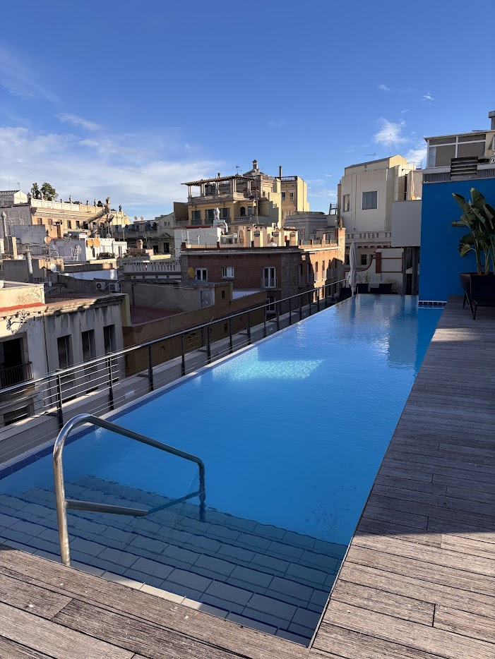
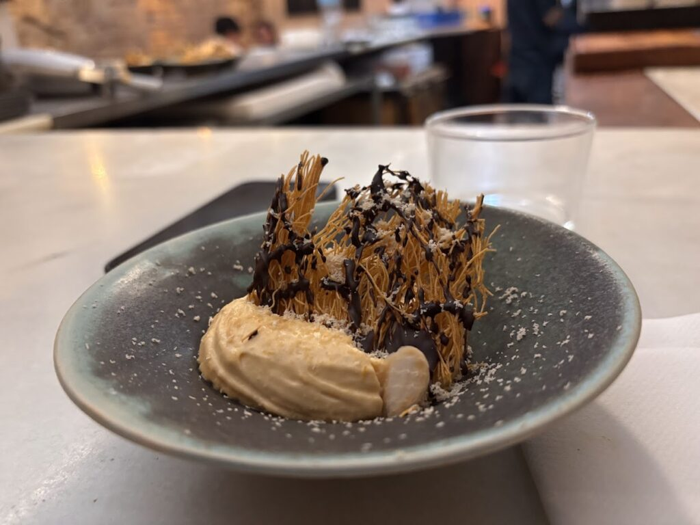
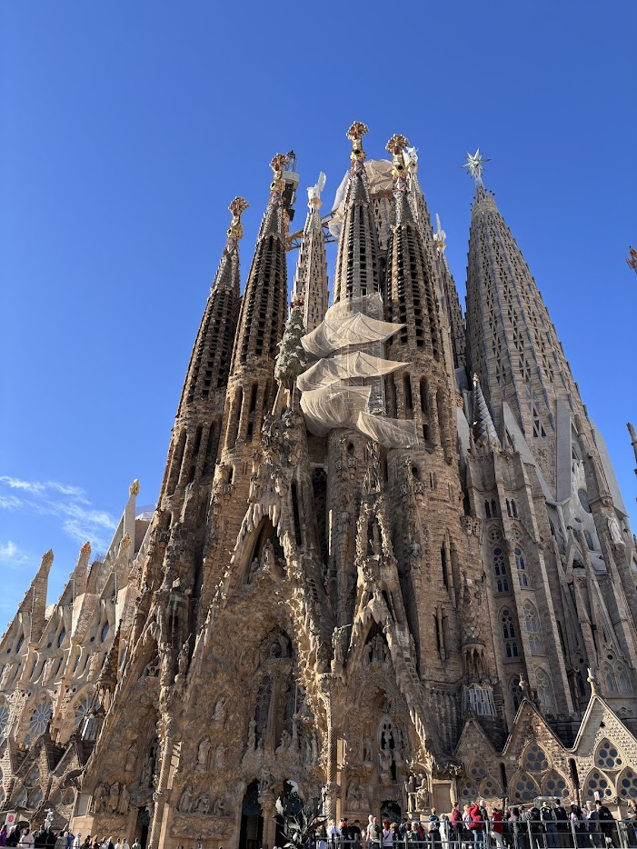
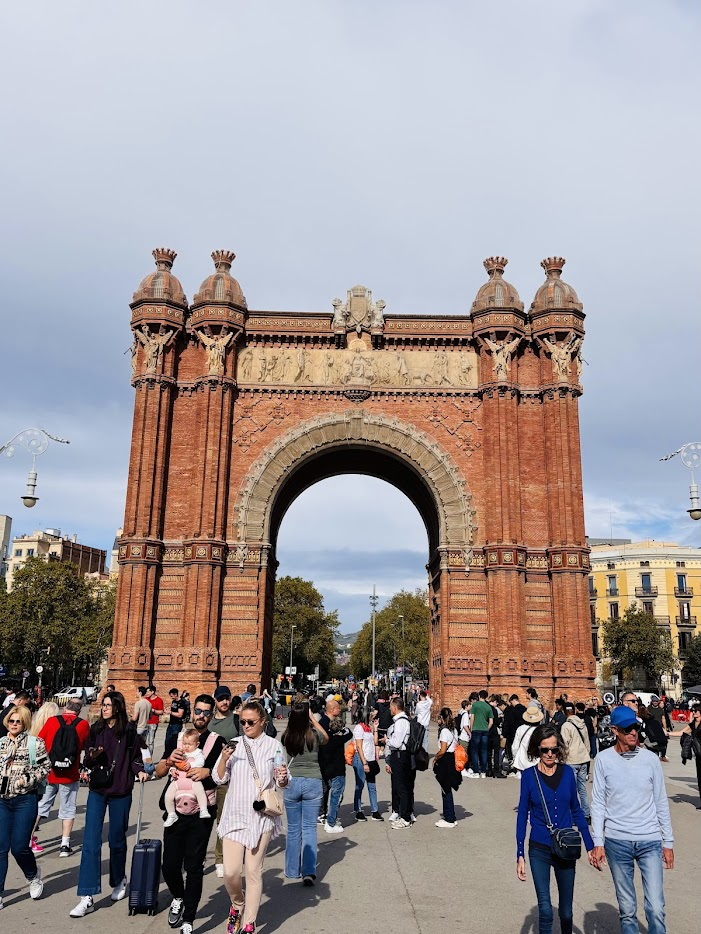
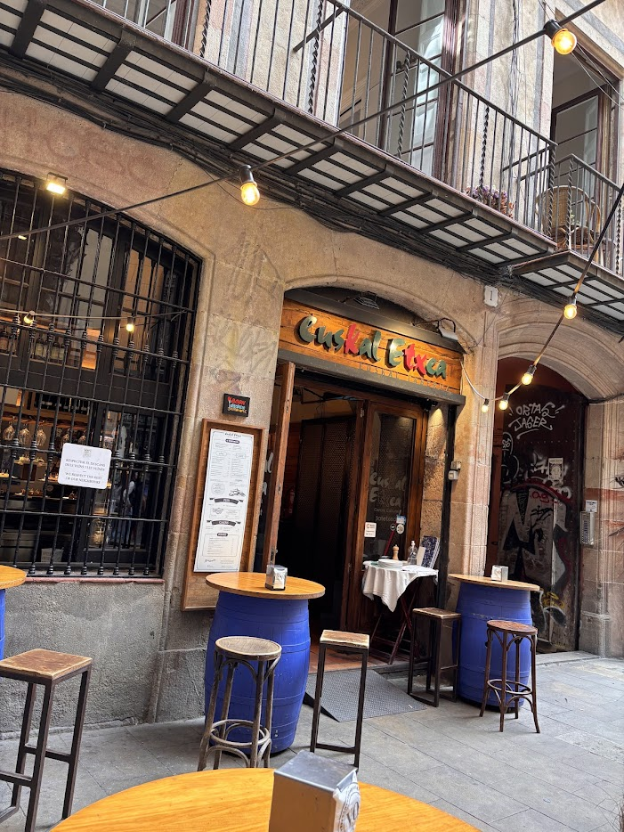

Afgelopen weekend besloten we er even tussenuit te gaan voor een korte maar krachtige citytrip: 48 uur in het prachtige Barcelona. Deze bruisende stad heeft zoveel te bieden, en zelfs in een kort tijdsbestek wisten we volop te genieten. Hieronder lees je hoe we ons weekend hebben beleefd.

## Dag 1: Aankomst in Barcelona

### 12:20 – Vlucht Brussels (BRU) > Barcelona (BCN)

Twee weken geleden hadden we onze vlucht geboekt via Brussels Airlines. De vertrektijd rond het middaguur was ideaal, omdat we ’s ochtends nog de kinderen naar school konden brengen en daarna rustig naar Brussels Airport konden rijden.

We kozen bewust voor Brussels Airlines, omdat deze op El Prat de Llobregat vliegt, de dichtstbijzijnde luchthaven van Barcelona. Low-cost airlines zoals Ryanair vliegen op Girona, wat een stuk verder weg ligt. Met onze strakke planning leek El Prat, dat ook nog eens een directe metroverbinding heeft naar het centrum van de stad, de perfecte keuze. Doordat we enkel handbagage hadden en online ingecheckt, konden we rechtstreeks naar de gate en verliep alles vlot.

### 14:20 – Metro naar het centrum van Barcelona

Na een soepele landing pakten we direct de metro naar het centrum. Op voorhand hadden we een **Hola** [Barcelona Travel Card](https://www.holabarcelona.com/tickets/hola-bcn-barcelona-travel-card) voor 48 uur gekocht, wat ons onbeperkte toegang gaf tot het openbaar vervoer in de stad. Vanuit Terminal 1 bracht de L9S-metro ons via een overstap in Torrassa naar de Plaça de Catalunya, vanwaar het nog maar een paar minuten lopen was naar ons hotel.

### **16:00 – Check-in in Hotel Barcelona Catedral**

We hadden gekozen voor het [Hotel Barcelona Catedral](https://www.barcelonacatedral.com/en/), ideaal gelegen in het hart van de gotische wijk. Het hotel bevindt zich op loopafstand van de beroemde kathedraal en de levendige Ramblas. Bij aankomst werden we hartelijk verwelkomd met een glas wijn en een kaasproeverij – een fantastische start van ons verblijf! Het hotel had ook een dakterras met zwembad, maar vanwege het drukke schema besloten we daar geen gebruik van te maken.

### **17:00 – Verkenning van de Gotische Wijk**

Barcelona is een stad waar je eindeloos kunt dwalen door smalle, sfeervolle straatjes. Vooral in de Gotische Wijk kom je op elke hoek iets interessants tegen: gezellige boetiekjes, verborgen pleinen en tal van historische bezienswaardigheden.

### **20:00 – Diner bij Brugarol Barcelona**

Voor onze eerste avond hadden we een tafel gereserveerd bij **Brugarol Barcelona**, een restaurant dat al lang op ons lijstje stond. Hier genoten we van een heerlijk 9-gangenmenu met Catalaanse gerechten voor een vaste prijs van €70. Een absolute aanrader voor liefhebbers van verfijnde keuken!

* * *

## Dag 2: Sightseeing en shoppen in Barcelona

### **09:00 – Ontbijt bij een lokale bakker**

In Barcelona is het ontbijt simpel maar heerlijk. Overal vind je gezellige bakkers waar je terecht kunt voor verse broodjes en zoetigheden. We besloten daarom ons hotelontbijt over te slaan en te genieten van de lokale lekkernijen.

### **10:30 – Bezienswaardigheden verkennen**

Onze eerste stop van de dag was de iconische _Sagrada Familia_. Helaas hadden we geen tickets vooraf geboekt, waardoor een bezoek aan het interieur niet mogelijk was, maar alleen al het bewonderen van dit imposante gebouw van buiten was indrukwekkend. Daarna wandelden we over de sfeervolle Av. de Gaudí richting de _Sant Pau Art Nouveau Site_, een minder bekende maar prachtige bezienswaardigheid.

### **14:00 –** **Winkelen rond Plaça de Catalunya**

Na ons ochtendavontuur besloten we wat tijd vrij te maken voor een winkeluitje. Plaça de Catalunya is de perfecte startplek om de vele winkels en boetiekjes van Barcelona te ontdekken. Van grote merken tot lokale shops—deze wijk biedt voor ieder wat wils.

### **17:00 – Tapas bij Mercat de la Boqueria**

Na een middag vol cultuur en shopping sloten we af in de beroemde versmarkt _Mercat de la Boqueria_. Hier genoten we van een reeks heerlijke tapas en vergaapten we ons aan de kraampjes vol verse ingrediënten. De avond eindigde ontspannen met een drankje in een van de nabijgelegen cafés.

* * *

## Dag 3: Laatste ochtend in Barcelona

### **08:30 – Nog een keer ontbijten bij de bakker**

Ook deze ochtend zochten we een gezellige bakkerij op voor een licht ontbijt met verse koffie en gebak. Het is een must-do om de lokale bakkerijtjes in Barcelona te ervaren.

### **09:30 – Bezoek aan het Picasso Museum**

Onze laatste ochtend stond in het teken van cultuur. We bezochten het _Picasso Museum_, dat een prachtig overzicht biedt van het leven en werk van de beroemde kunstenaar. In ongeveer anderhalf uur hadden we de hele collectie bewonderd, wat perfect paste in onze strakke planning.

### **12:00 – Tijd voor vertrek**

Voordat we vertrokken, namen we nog even de tijd om te genieten van een terrasje op een van de vele pleinen. Daarna haalden we onze bagage op in het hotel en namen we de metro terug naar de luchthaven, waar onze vlucht naar huis op ons wachtte.

### **15:10 – Terugvlucht naar Brussels Airport**

Na een korte vlucht van 1 uur en 50 minuten landden we weer veilig in Brussel. Met een hoofd vol herinneringen en een voldaan gevoel keerden we terug naar huis. Barcelona, tot de volgende keer!

* * *

## Onze Tips voor 48 Uur in Barcelona:

1. **Hola Barcelona Travel Card**: Ideaal voor onbeperkt reizen binnen de stad.

3. **Brugarol Barcelona**: Een culinaire aanrader voor liefhebbers van Catalaanse gerechten.

5. **Sant Pau Art Nouveau Site**: Een minder bekende maar schitterende bezienswaardigheid.

7. **Mercat de la Boqueria**: Voor de beste tapas en een authentieke marktervaring.

9. **Picasso Museum**: Perfect voor kunstliefhebbers met beperkte tijd.

**Barcelona heeft ons hart gestolen. Twee dagen is misschien kort, maar zeker genoeg om verliefd te worden op deze bruisende stad!**
